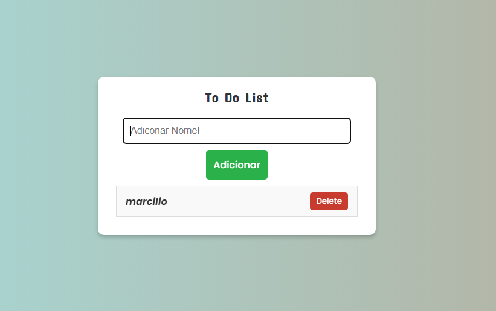

README

 

## 🖥️ Projeto

Esse é um Web desenvolvido no curso de Dev Fullstack da Infinity School com o professor Luan Oliveira.

### 🔎 Tecnologias

Esse projeto foi desenvolvido com as seguintes tecnologias:

- HTML
- CSS
- JS
- Github

## 🎨 Layout

Você pode visualizar o layout do projeto através
[desse link](https://github.com/marciliossalgado)

### 🧑‍💻 Creditos

Projeto foi feito em casa para projetos de aula na [Infinity School](https://infinityschool.com.br/).

Professor [Luan Oliveira](https://www.linkedin.com/in/luanpdd/).